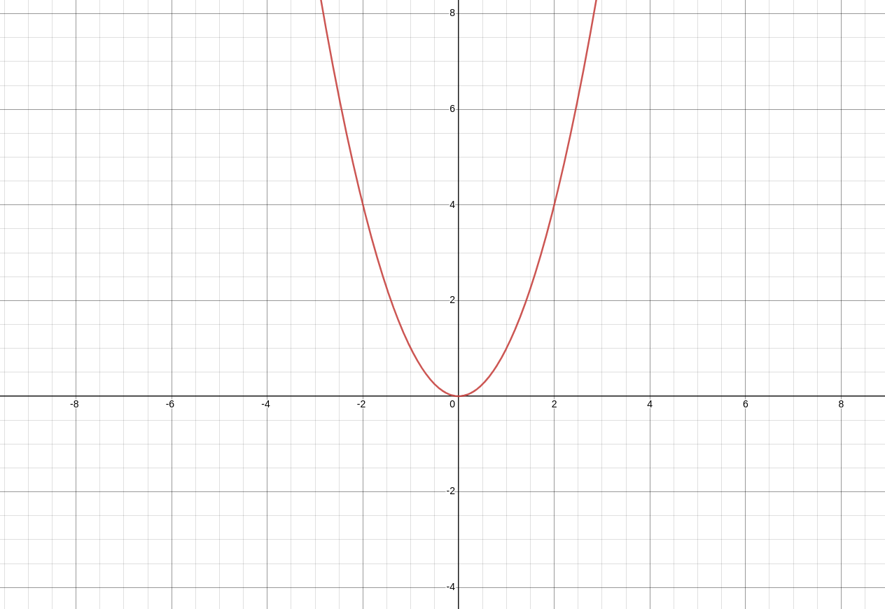

# 0.2. A little bit of mathematics

In this section, we'll delve into some fundamental mathematical concepts that are crucial for understanding programming. We'll cover topics such as:

- Basic arithmetic operations
- Algebraic expressions
- Functions and their graphs
- Number systems: binary, decimal, and hexadecimal
- Logic and boolean algebra

Having a grasp of these mathematical concepts will provide a strong foundation for your journey into programming. Although a good understanding of mathematics is not really necessary to learn programming, I do beleive that to be a good programmer, one must have a firm grasp of this powerful tool.

## Basic Arithmetic Operations

In programming, mastering basic arithmetic operations is fundamental as they form the building blocks for more complex computations. Let's explore each operation in more detail:

### Addition (+)

Addition is the process of combining two or more numbers to find their total sum. It's represented by the plus symbol (`+`). For example:

$2 + 6 = 8$

### Subtraction (-)

Subtraction involves finding the difference between two numbers. It's represented by the minus symbol (`-`). For example:

$8 - 6 = 2$

### Multiplication (*)

Multiplication is the process of repeated addition of a number. It's represented by the asterisk symbol (`*`). For example:

$2 * 4 = 8$

### Division (/)

Division involves splitting a number into equal parts or finding how many times one number can fit into another. It's represented by the forward slash symbol (`/`). For example:

$8 / 4 = 2$

### Modulus (%)

Modulus is the remainder when one number is divided by another. It's represented by the percent symbol (`%`). For example:

$10\ \%\ 3 = 1$

This means that when we divide $10$ by $3$, we get $3$ with $1$ left over. $10 = 3 * 3 + 1$

### Exponentiation (**)

Exponentiation involves raising a number to a power. In programming it is frequently represented by the double asterisk symbol (`**`), but in maths the caret (`^`) or superscripting (like$^{this}$) is used. For example:

$2 \verb!^! 3 = 2 ^ 3 = 2 ** 3 = 8$

The value of anything to the power of $0$ is always 1, and if the power is negative it is as simple as dividing $1$ by its positive power, for instance:
$ 5 ** 0 = 1$
$26 ** 0 = 1$
And for the negative powers:
$4 ** -1 = 1 / 4 ** 1 = 1 / 4 = 0.25$
$10 ** -2 = 1 / 10 ** 2 = 1 / 100 = 0.01$

Understanding these basic arithmetic operations is crucial for performing calculations and solving problems in programming. Practice using these operations in various scenarios to solidify your understanding.

## Algebraic Expressions

Algebraic expressions are mathematical expressions that consist of variables, constants, and mathematical operations. In programming, understanding algebraic expressions is crucial for solving problems and writing efficient code. Let's explore some key concepts:

### Variables

These are symbols that represent unknown or changing values. In programming, variables are used to store and manipulate data. For example:
    $x = 5$
This $x$ can later be used to reference the value it 'holds'. For instance if we want to calculate the sum of values that the user gives us, we will use variables, something like this:

```
make the variable `X` take the value of user input
make the variable `Y` take the value of user input
print the value `X + Y` on the screen
```

This is pseudocode, a method used to outline code in a human-readable format, without adhering to the rules of any given programming language. It is like a blueprint for writing code. You will be seeing more of it in the following chapters.

### Constants

Constants are fixed values that do not change. They are similar to variables in the sense that they name a bit of data, be that a number like $PI=3.14159$, some string of characters like $greeting=Hello\ world!$ or a boolean value like $valid = false$.

### Some examples of expressions

```
First we will make a variable named x, and make its value equal to 4, since its value does not need to change during the 'program' we can just make it a constant
constant x = 4
Then we will take input from the user, and make a variable named y to store it
y = input from user
Then we can raise x to the degree of y, and save the result in a new variable 'result'
result = x ** y
Then we can just return the result to the user, for instance by printing it on the screen
print 'result' to the screen
```

Understanding algebraic expressions allows programmers to model real-world problems, create algorithms, and analyze data effectively. Practice manipulating algebraic expressions to strengthen your problem-solving skills.

## Functions

Functions are mathematical constructs that relate an input value to an output value. In programming, functions encapsulate a set of instructions that perform a specific task. Understanding functions is essential for designing algorithms and analyzing data.

### Definition of a Function

A function is a rule that assigns to each input value exactly one output value. It's typically denoted by $f(x)$, where $x$ is the input variable.

For example:
$f(x) = x**2$

### Graphs of Functions

The graph of a function visually represents the relationship between input and output values. It's plotted on a coordinate system, with the input values on the x-axis (the horizontal line) and the output values on the y-axis (the vertical line).

For example, the graph of $f(x) = x^2$ would look like this:


Understanding functions and their graphs enables programmers to model real-world phenomena, analyze data trends, and optimize algorithms. Practice interpreting and graphing functions to enhance your programming skills.

This wraps up our exploration of fundamental mathematical concepts. Next, we'll delve into number systems, including binary, decimal, and hexadecimal, which are essential for understanding how computers represent and process data.

## Number Systems

In computing and mathematics, numbers are represented using different number systems. The most common ones are the decimal system (base-10), binary system (base-2), octal (base-8) and hexadecimal system (base-16). Let's explore each of these systems:

### Decimal System (Base-10)

The decimal system is the one we're most familiar with, as it's used in everyday life. It consists of ten digits: 0, 1, 2, 3, 4, 5, 6, 7, 8, and 9. In the decimal system, each digit's position represents a power of 10. For example:

- `356`: In this number, `3` represents $3 * 100$, `5` represents $5 *10$, and `6` represents $6 * 1$,
  that is $3 * 10**2$, $5 * 10**1$ and $6 * 10**0$

### Binary System (Base-2)

The binary system is used extensively in computers because digital electronics can easily represent two states: on (1) and off (0). It consists of only two digits: 0 and 1. Each digit's position represents a power of 2. For example:

- `1010`: In binary, this number represents `(1 * 2**3) + (0 * 2**2) + (1 * 2**1) + (0 * 2**0)`, which equals `10` in decimal.

### Hexadecimal System (Base-16)

The hexadecimal system is often used in computing because it provides a more compact way to represent large binary numbers. It consists of sixteen digits: 0-9 and A-F, where A represents 10, B represents 11, and so on up to F, which represents 15. Each digit's position represents a power of 16. For example:

- `2A`: In hexadecimal, this number represents `(2 * 16^1) + (10 * 16^0)`, which equals `42` in decimal.

There exist many more number systems out there, some of the more used in programming are: base-8, base-32 and base-64. You may have noticed that all of the systems mentioned (excluding the classic decimal system) have bases which are exponents of 2. This is because computers, on the circuit level use binary, they either 'send' power through the wire (which corresponds to a 1) or they don't (which is a 0). In the octal system, which uses base $8=2**3$ every digit represents $3$ digits in binary, each hexadecimal digit represents 4, each base-32 digit represents 5 and so on. This is done to 'compress' the values and make them more human readable.

### Why It Matters

Understanding different number systems is crucial for programmers because computers operate internally using binary. Learning to convert between decimal, binary, and hexadecimal allows programmers to work directly with binary data, optimize algorithms, and understand how data is stored and manipulated in computer memory.

By grasping the basics of number systems, you'll gain insights into how computers represent and process information, empowering you to become a more proficient programmer.

## Logic and Boolean Algebra

Logic and Boolean algebra are foundational concepts in computer science and programming. They deal with expressions that evaluate to either true or false, known as boolean values. Let's delve into these concepts:

### Boolean Values

Boolean values represent the truth of a statement and can only have two possible values: true or false. In programming, true is often represented by the value `1` and false by `0`. Boolean values are the building blocks of logical expressions and decisions in programming.

### Logical Operators

Logical operators are used to manipulate boolean values and perform logical operations. The basic logical operators include:

- **AND (`&&`)**: Returns true if both operands are true.
- **OR (`||`)**: Returns true if at least one operand is true.
- **NOT (`!`)**: Returns the opposite boolean value of the operand.

### Boolean Expressions

Boolean expressions are expressions that evaluate to boolean values. They are formed using logical operators and can involve comparisons between variables or constants. For example:

- `x > 5 && y < 10`: This expression evaluates to true if variable `x` is greater than $5$ and variable `y` is less than $10$.
- `!(x < 7) || (y > 12)`: This expression evaluates to true if the variable `x` is NOT smaller than $7$ OR the variable `y` is bigger than $12$.

### Boolean Algebra

Boolean algebra is a branch of algebra that deals with boolean values and logical operations. It's used to simplify and analyze logical expressions. Some key laws of boolean algebra (which you don't need to memorize) include:

- **Identity Laws**: `x && true = x`, `x || false = x`
- **Commutative Laws**: `x && y = y && x`, `x || y = y || x`
- **Distributive Laws**: `x && (y || z) = (x && y) || (x && z)`, `x || (y && z) = (x || y) && (x || z)`

### Why is this important?

Boolean algebra is the basis of computing. Computers are, at the lowest levels, just big boolean algebra machines. The inner circuits of a CPU are filled with hundreds of millions of *logic gates* which are tiny electronic components which perform these boolean expressions with the operands being the electricity going through the wires (again, current means `1` and no current means `0`). We will discuss the topic of computer architecture later in the series, but before that boolean algebra will still come in handy, since understanding logic and boolean algebra is essential for writing conditional statements, loops, and other control structures in programming. It allows programmers to make decisions based on conditions and control the flow of their programs effectively.

By mastering logic and boolean algebra, you'll be equipped to write more robust and efficient code, making you a better programmer overall.

[Next](3.md)
